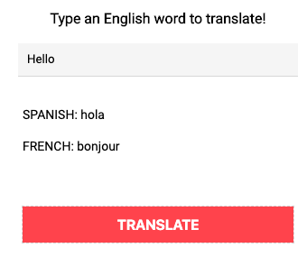

# Language-Translator
A Language Translator App written in Python with a Remi GUI interface.

The app pulls in data from an external csv file and displays the results in a remi interface.

The link from Repl.it is:

https://repl.it/@chaudhryna/Hard-Wrap-Up-Your-Language-Translator-with-GUI

